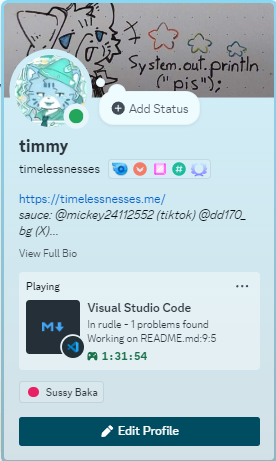

# rudle (สนิม ver)

A Wordle game written in Rust with CLI and Hard mode included with 15,000+ 5 letters words. Written in Rust but it's [Sanim](https://github.com/timelessnesses/sanim)

## Usage

Execute the binary with `-h` for setting predefined options like loading another word library with either append or replace mode, etc.

## omg

1 hour and 30 minutes well spent  

